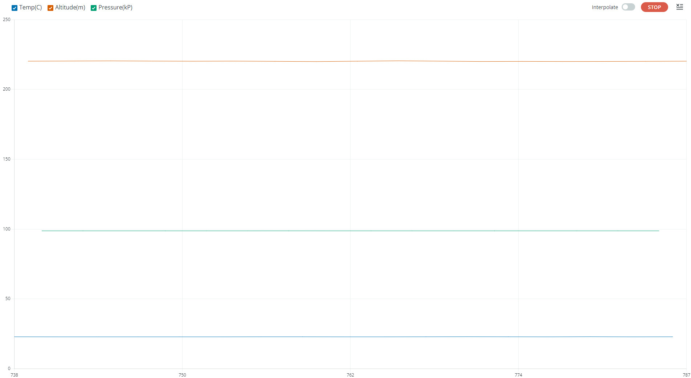

# ICP201xx Arduino library
This arduino library for the [TDK/Invensense ICP201xx MEMS Barometric Pressure sensors](https://invensense.tdk.com/products/smartpressure/icp-20100/).
The ICP-20100 pressure sensor provides a high-accuracy, low power, barometric pressure and temperature sensor solution, that integrates a capacitive pressure sensor for monitoring pressure changes in the range of 30 to 110 kPa.
This library supports ICP-201xx devices.

# Software setup
Use Arduino Library manager to find and install the ICP201xx library.

# Hardware setup
There is currently no Arduino shield for the ICP-201xx sensors.
The wiring must be done manually between the Arduino motherboard and the ICP-201xx eval board.
The below wiring description is given for an Arduino Zero board, it depends on the interface to be used:
* I2C

|Arduino Zero|ICP-201xx eval board|
| --- | --- |
| 5V         | CN1.19         |
| GND        | CN1.11         |
| SDA        | CN1.18         |
| SCL        | CN1.16         |

* SPI

|Arduino Zero|ICP-201xx eval board|
| --- | --- |
| 5V         | CN1.19         |
| GND        | CN1.11         |
| MISO=SPI.1 | CN1.20         |
| MOSI=SPI.4 | CN1.18         |
| SCK=SPI.3  | CN1.16         |
| CS=DIG.8   | CN1.4          |

Note: SPI Chip Select can be mapped on any free digital IO, updating the sketches accordingly.

* Interrupt

|Arduino Zero|ICP-201xx eval board|
| --- | --- |
| DIG.2        | CN1.3        |

Note: Interrupt pin can be mapped on any free interruptable IO, updating the sketches accordingly

# Library API

## Create ICP201xx instance

**ICP201xx(TwoWire &i2c,bool lsb)**

Create an instance of the ICP201xx that will be accessed using the specified I2C. The LSB of the I2C address can be set to 0 or 1.  
I2C default clock is 400kHz.

```C++
ICP201xx ICP(Wire,0);
```

**ICP201xx(TwoWire &i2c,bool lsb, uint32_t freq)**

Same as above, specifying the I2C clock frequency (must be between 100kHz and 1MHz)

```C++
ICP201xx ICP(Wire,0,1000000);
```

**ICP201xx(SPIClass &spi,uint8_t cs_id)**

Create an instance of the ICP201xx that will be accessed using the specified SPI. The IO number to be used as chip select must be specified.  
SPI default clock is 6MHz.

```C++
ICP201xx ICP(SPI,8);
```

**ICP201xx(SPIClass &spi,uint8_t cs_id, uint32_t freq)**

Same as above, specifying the SPI clock frequency (must be between 100kHz and 12MHz)

```C++
ICP201xx ICP(SPI,8,12000000);
```

## Initialize the ICP201xx
Call the begin method to execute the ICP201xx initialization routine. 

**int begin()**

Initializes all the required parameters in order to communicate and use the ICP-201xx sensor.

```C++
ICP.begin();
```

## Start sensor

**int start()**

This method configures and starts the sensor with an ODR of 25Hz (Operational mode MODE0 power consumption 211uA).

```C++
ICP.start();
```

**int startFifoInterrupt(uint8_t intpin, ICP201xx_irq_handler handler, uint8_t fifo_watermark)**

This method configures and starts the sensor with an ODR of 25Hz (Operational mode MODE0 power consumption 211uA).
An interrupt is reported on pin *intpin* when there are at least *fifo_watermark* samples in the FIFO and *handler* callback is called.
Any interuptable pin of the Arduino can be used for *intpin*.

```C++
ICP.startFifoInterrupt(2,irq_handler,10);
```

**int startPressureInterrupt(uint8_t intpin, ICP201xx_irq_handler handler, float pressure)**

This method configures and starts the sensor with an ODR of 25Hz (Operational mode MODE0 power consumption 211uA).
An interrupt is reported on pin *intpin* when the measured pressure crosses *pressure* level and *handler* callback is called.
Any interuptable pin of the Arduino can be used for *intpin*.

```C++
ICP.startPressureInterrupt(2,irq_handler,100))
```

**int startPressureChangeInterrupt(uint8_t intpin, ICP201xx_irq_handler handler, float pressure_change)**

This method configures and starts the sensor with an ODR of 25Hz (Operational mode MODE0 power consumption 211uA).
An interrupt is reported on pin *intpin* when the measured pressure difference between 2 samples is higher than the specified *pressure_change* and *handler* callback is called.
Any interuptable pin of the Arduino can be used for *intpin*.

```C++
ICP.startPressureChangeInterrupt(2,irq_handler,0.1))

```

**int getData(float&ast; pressure, float&ast; temperature)**

This method gets the measured pressure (in kP) and temperature (in C degree).
The function returns 0 if a measure was available, negative value if not.

```C++
float pressure_kP,temperature_C;
if(ICP.getData(&pressure_kP,&temperature_C) == 0)
{
    Serial.print("Pressure:");
    Serial.println(pressure_kP);
    Serial.print("Temp:");
    Serial.println(temperature_C);
}
```

**int singleMeasure(float&ast; pressure_kp, float&ast; temperature_C)**

This method triggers a single measure and gets the measured pressure (in kP) and temperature (in C degree).
The function returns 0 in case of success, non-zero in case of error.

```C++
float pressure_kP,temperature_C;
ICP.singleMeasure(&pressure_kP,&temperature_C);
```

## Conversion functions
**float convertToHeight(float pressure_kp, float temperature_C)**

This helper function estimates the height from the measured pressure and temperature.
Pressure is in kPascal and temperature in Celsius degree.
The function returns the estimated height in meters.

**float convertToPressure(float height_m, float temperature_C)**

This helper function estimates the pressure at provided height and temperature.
Height is in meters and temperature in Celsius degree.
The function returns the estimated pressure in kPascal.

# Available Sketches

**Polling_I2C**

This sketch initializes the ICP201xx with the I2C interface, and starts logging pressure, temperature data and the corresponding height. Sensor data can be monitored on Serial monitor or Serial plotter.

**Polling_SPI**

This sketch initializes the ICP201xx with the SPI interface, and starts logging pressure, temperature data and the corresponding height. Sensor data can be monitored on Serial monitor or Serial plotter.

**FIFO_Interrupt**

This sketch initializes the ICP201xx with the I2C interface and interrupt PIN2 triggered when FIFO contains 10 samples, and starts logging Pressure, Temperature data from the FIFO and the corresponding height. Sensor data can be monitored on Serial monitor or Serial plotter.

**Pressure_Interrupt**

This sketch initializes the ICP201xx with the I2C interface and interrupt PIN2 triggered when the measured pressure crosses 100kP, and display a message when interrupt is triggered.

**Pressure_Change_Interrupt**

This sketch initializes the ICP201xx with the I2C interface and interrupt PIN2 triggered when the difference between 2 pressure samples is bigger than 0.1kP, and displays a message when interrupt is triggered.

**Height_Interrupt**

This sketch initializes the ICP201xx with the I2C interface and interrupt PIN2 triggered when the pressure corresponds to the measured height at reset plus 50cm , and displays a message when interrupt is triggered.

# Arduino Serial Plotter

When the ICP201xx is logging, the pressure, the temperature and the corresponding height estimation can be monitored with the Arduino Serial Plotter (Tools->Serial Plotter).



# Using a different device interface

When switching from a Sketch using the I2C to another using the SPI (or the opposite), it is required to power off the device.
